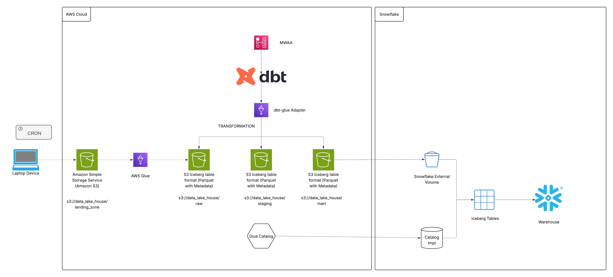

# Data Lakehouse Architecture: AWS Glue + Iceberg + DBT + Snowflake

## Executive Summary

This document outlines a modern data lakehouse architecture that leverages AWS services (S3, Glue, MWAA) with Apache Iceberg tables, DBT for transformations, and Snowflake for analytics consumption. The design illustrates a medallion-inspired architecture with landing, raw, staging, and mart layers.

---

## Architecture Overview
<p align="center">
  
</p>

## Architecture Components

### 1. Data Ingestion Layer

#### CSV File Generation
- **Source**: Local laptop generates CSV files (This is only a placeholder for now. The CSV files may be obtained from other sources using tools like Fivetran / Airbyte etc)
- **Automation**: Cron job for scheduled uploads (Only for the use case where CSV files are in local laptop device)
- **Destination**: `s3://data_lake_house/landing_zone/`

#### AWS Glue ETL Job
- **Input**: CSV files from landing zone
- **Process**: 
  - Read CSV files
  - Apply schema validation and data quality checks
  - Convert to Apache Iceberg format
- **Output**: Iceberg tables in `s3://data_lake_house/raw/`
- **Catalog**: AWS Glue Data Catalog manages table metadata

### 2. Data Storage Layer

#### S3 Bucket Structure
```
s3://data_lake_house/
├── landing_zone/          # Raw CSV files
├── raw/                   # Iceberg tables (Bronze layer)
├── staging/               # Iceberg tables (Silver layer)
└── marts/                 # Iceberg tables (Gold layer)
```

#### Apache Iceberg Tables
- **Format**: Parquet with Iceberg metadata
- **Features**:
  - ACID transactions
  - Schema evolution
  - Time travel capabilities
  - Hidden partitioning
  - Snapshot management

### 3. Data Transformation Layer

#### MWAA (Managed Workflows for Apache Airflow)
- **Purpose**: Orchestrates DBT jobs
- **Scheduling**: Manages dependencies and execution order
- **Monitoring**: Tracks job success/failure

#### DBT with dbt-glue Adapter
- **Stage 1**: Raw → Staging
  - Data cleansing
  - Standardization
  - Deduplication
  - Business rule application
  
- **Stage 2**: Staging → Marts
  - Dimensional modeling
  - Aggregations
  - Business metrics calculation
  - SCD implementation

### 4. Analytics Consumption Layer

#### Snowflake External Tables
- **Integration**: Read Iceberg tables from `s3://data_lake_house/marts/`
- **Access**: Query marts data without data duplication
- **Use Cases**:
  - BI reporting
  - Ad-hoc analysis
  - ML model training

##### Snowflake Configuration Details

**Step 1: Create External Volume**
Snowflake uses an external volume to establish a connection to the S3 location where Iceberg tables reside.

```sql
-- Create storage integration for S3 access
CREATE STORAGE INTEGRATION iceberg_s3_integration
  TYPE = EXTERNAL_STAGE
  STORAGE_PROVIDER = 'S3'
  ENABLED = TRUE
  STORAGE_AWS_ROLE_ARN = 'arn:aws:iam::123456789012:role/SnowflakeS3AccessRole'
  STORAGE_ALLOWED_LOCATIONS = ('s3://data_lake_house/marts/');

-- Retrieve the AWS IAM User ARN and External ID for trust relationship
DESC STORAGE INTEGRATION iceberg_s3_integration;

-- Create external volume pointing to Iceberg tables location
CREATE EXTERNAL VOLUME iceberg_external_volume
  STORAGE_LOCATIONS = (
    (
      NAME = 'iceberg-marts-volume'
      STORAGE_PROVIDER = 'S3'
      STORAGE_BASE_URL = 's3://data_lake_house/marts/'
      STORAGE_AWS_ROLE_ARN = 'arn:aws:iam::123456789012:role/SnowflakeS3AccessRole'
    )
  );
```

**Step 2: Configure AWS IAM Role**

Create an IAM role in AWS with the following trust relationship and permissions
```json
// Trust Relationship
{
  "Version": "2012-10-17",
  "Statement": [
    {
      "Effect": "Allow",
      "Principal": {
        "AWS": "arn:aws:iam::SNOWFLAKE_ACCOUNT_ID:user/SNOWFLAKE_USER"
      },
      "Action": "sts:AssumeRole",
      "Condition": {
        "StringEquals": {
          "sts:ExternalId": "SNOWFLAKE_EXTERNAL_ID"
        }
      }
    }
  ]
}

// IAM Policy
{
  "Version": "2012-10-17",
  "Statement": [
    {
      "Effect": "Allow",
      "Action": [
        "s3:GetObject",
        "s3:GetObjectVersion",
        "s3:ListBucket",
        "s3:GetBucketLocation"
      ],
      "Resource": [
        "arn:aws:s3:::data_lake_house/marts/*",
        "arn:aws:s3:::data_lake_house"
      ]
    }
  ]
}
```

**Step 3: Create Iceberg Catalog Integration**

```sql
-- Create catalog integration for Iceberg
CREATE CATALOG INTEGRATION iceberg_glue_catalog
  CATALOG_SOURCE = GLUE
  CATALOG_NAMESPACE = 'iceberg_db'
  TABLE_FORMAT = ICEBERG
  GLUE_AWS_ROLE_ARN = 'arn:aws:iam::123456789012:role/SnowflakeGlueAccessRole'
  GLUE_CATALOG_ID = '123456789012'
  GLUE_REGION = 'us-east-1'
  ENABLED = TRUE;
```

**Step 4: Create Iceberg Tables in Snowflake**

```sql
-- Option 1: Create external table using Glue catalog
CREATE ICEBERG TABLE fct_property_day
  EXTERNAL_VOLUME = 'iceberg_external_volume'
  CATALOG = 'iceberg_glue_catalog'
  CATALOG_TABLE_NAME = 'mart.bookings';

-- Do the same of dimension tables

-- Query the external Iceberg table
SELECT * FROM fct_property_day LIMIT 10;
```

##### Zero-Copy Query Architecture

Snowflake queries Iceberg tables directly from S3 without copying data by reading metadata from the AWS Glue Catalog to identify relevant Parquet files. It then uses its compute clusters to scan only the necessary files from S3 and process results in-memory. This eliminates data duplication, reduces storage costs, and avoids ETL loading operations while maintaining query performance through Iceberg's metadata pruning and predicate pushdown capabilities.


---

## Data Flow

1. **Ingestion**: Cron job uploads CSV files to S3 landing zone
2. **Conversion**: AWS Glue job converts CSV to Iceberg format in raw layer
3. **Transformation** : DBT jobs transform raw data to staging and then to mart layer
4. **Consumption**: Snowflake queries mart tables via external table integration

---

## Alternative Architecture Considerations

### Option 1: Full Snowflake Native
- Load data directly into Snowflake
- Eliminate Glue, MWAA, Iceberg
- **Trade-off**: Higher costs, vendor lock-in, but simpler architecture

---

## Monitoring and Observability

### Key Metrics to Track
- **Ingestion**: File upload success rate, file size trends
- **Glue Jobs**: Duration, DPU usage, success/failure rates
- **DBT**: Model execution time, test pass rates
- **Storage**: S3 bucket size, object count growth
- **Snowflake**: Query performance, credit consumption
- **Data Quality**: Rule violation rates, anomaly detection

### Recommended Tools
- Amazon CloudWatch for AWS metrics
- MWAA built-in monitoring
- DBT Cloud or elementary for DBT observability
- Snowflake query history and account usage views
